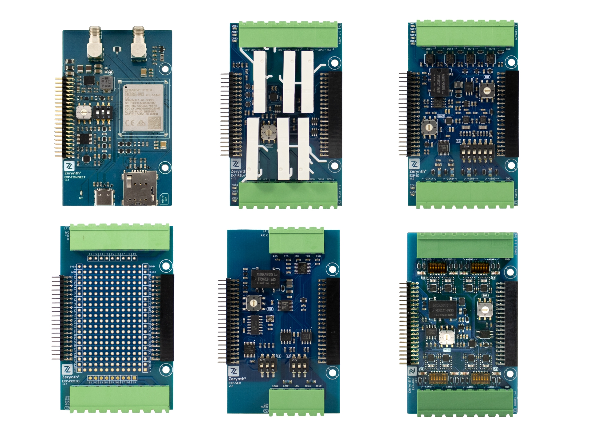
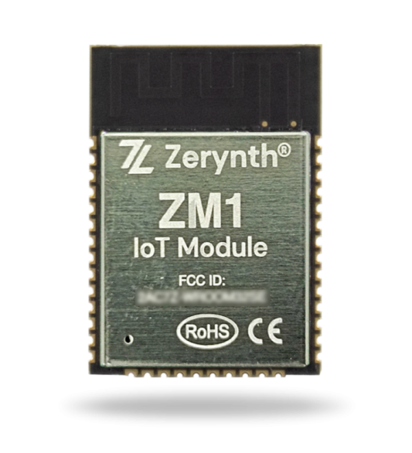
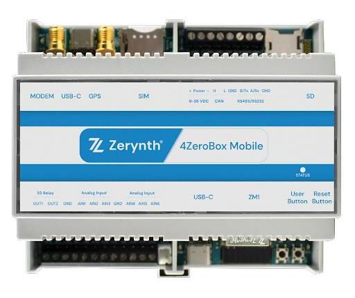

# Zerynth hardware platform

Easy-to-use hardware platform for creating Industrial IoT applications and connecting products to IoT.

## Development Boards 

The ZM1-DB is a flexible, modular, development board that features the ZM1 SoM. With the integrated Zerynth SDK, It is ready for developing a prototype or a proof-of-concept right out of the box.

<figure>
  
</figure>

The ZM1-DB easily connects with the Zerynth expansion boards. The expansion system enables fast and efficient prototyping, and adding/removing functionalities in no time.

[Buy now at this link](https://www.zerynth.com/products/hardware/zm1-db/)

For more information on the ZM1-DB, Please refer to [ZM1-DB Hardware page here](ZM1-Development-Board.md)

## Modular Expansion System
Zerynth Development boards offer a game-changing way of connecting and adding functionalities to your application in a simple and easy way.
The development board offers a modular expansion system that adds expansion boards through the connectors on the board (Z-bus).

<figure>
  
</figure>

Expansion boards vary in features and functionality. Currently, Zerynth offers expansion boards for :

-   [EXP-AIN](EXP-AIN.md): Expansion board with 8 Industrial analog input channels
-   [EXP-CONNECT](EXP-CON.md): GSM-NB-IoT and GPS enabled expansion module.
-   [EXP-IO](EXP-IO.md): Industrial input/output board with 4 solid-state relays, 2 analog channels (4-20mA/0-10V/NTC/current clamp) channels, 2 opto-isolated digital inputs
-   [EXP-RELAY](EXP-RELAY.md): Relay board with 6 Electromechanical power relays rated 6A 250VAC.
-   [EXP-SER](EXP-SER.md): Serial Communication board with : CAN, RS232 and RS485  interfaces.
-   [EXP-PROTO](EXP-PROTO.md): Prototyping board for connecting and testing different types of sensors and devices.

## **ZM1 - IoT Module**

The ZM1-DB mounts the ZM1 module. The Zerynth Module ZM1 is a dedicated customized version of the ESP32-WROOM-32SE Module.
The Module is certified RoHS, CE/RED, e FCC (EU e US).

The ZM1 Module mounts onboard the ESP32-D0WD microcontroller, and is designed to be scalable and adaptive. The CPU clock frequency is adjustable from 80 MHz to 240 MHz, With an embedded 16 MB of SPI Flash memory and integrates a rich set of peripherals, ranging from SD interface, Ethernet, High speed SPI, UART, e I2C.

Inside the ZM1, the crypto element ATECC608A from Microchip has been integrated to handle secure connections in an easy manner, exchanging certificates and keys, encrypting messages over TLS protocol and using secure authentication procedures.

<figure>
  
</figure>

For more information on ZM1 module, [Please refer to the user manual of ZM1](https://www.zerynth.com/download/20127/)

## 4ZeroBox

Industrial IoT device for acquisition, monitoring and control of industrial machines
4ZeroBox is a versatile data acquisition unit, designed to be integrated into both legacy and modern industrial machines. The 4ZeroBox easily improves visibility on production processes, enables predictive maintenance of machines, and performs power management monitoring. 

<figure>
  
</figure>

The 4ZeroBox modernizes any industrial machinery and equipment allowing companies to drive their Industry 4.0 digital transformation.

## 4ZeroBox Mobile

The 4ZeroBox Mobile is an Industrial data acquisition device that features Cellular 2G, NB-IOT and Wi-Fi connectivity and GPS Capabilities. There are many onboard features like: a DIN-rail mountable case,  industrial grade sensor channels, support for Wi-Fi, Relays, support for CAN protocols, RS485, RS232 interfaces.
The 4ZeroBox Mobile can be integrated with any of Zerynth expansion boards. They can act as a prototype during the development stage, and a core for industrial applications.

<figure>
  
</figure>

Buy now at [this link](https://www.zerynth.com/products/hardware/)

[Click here to navigate ](4ZeroBox_mobile.md) to the 4ZeroBox Mobile Hardware Page.
