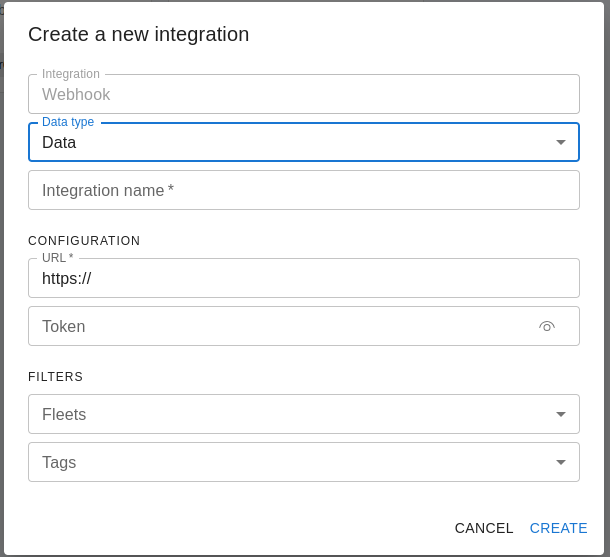

# Webhook
A webhook can send both data and events to an external service. The webhook can be configured to send data and events to a specific URL. 

To create a webhook go to "Data Management" -> "Integrations"  click on "New" and select "Webhook".

You will be asked to provide the following information:

- *Webhook type*: data or event;
- *Integration name* : the name of the integration;
- *URL*: the URL of the external service;
- *Token*: the token to authenticate the external service (optional). The provided token will be added in every request as a header with the name "X-AUTH-TOKEN";

It is also possible to set some filters to select the data and the events to be sent to the external service.

There are different filters type for data and events webhook.
For data webhook the following filters are available:

- *Fleets*: the list of fleets to be monitored;
- *Tags*: the list of tags to be monitored;

For event webhook the following filters are available:

- *Event types*: the list of event types to be monitored;
- *Fleets*: the list of fleets to be monitored.

 

#### Data format

A data object has the following keys

| Key              | Type      | Description                                                         |
|------------------|-----------|---------------------------------------------------------------------|
| timestamp_device | timestamp | The UTC timestamp in RFC3339 when the device sent the data point    |
| timestamp_in     | timestamp | The UTC timestamp in RFC3339 when the cloud ingested the data point |
| tag              | string    | The tag of the data point                                           |
| device_id        | string    | Id of the device                                                    |
| device_name      | string    | Name of the device               |
| asset_id         | string    | Id of the asset associated to the device (optional)                 |
| asset_name       | string    | Name of the asset associated to the device (optional)               |
| workspace_id     | string    | Workspace id of the device                                          |
| fleet_id         | string    | Fleet id of the device                                              |
| payload          | json      | A json payload.                                                     |


##### Example

```json
{
  "batch_id": "data8hm9vtljc5r2",
  "result": [
    {
      "id": "0",
      "timestamp_device": "2023-12-01T09:51:00Z",
      "timestamp_in": "2023-12-01T09:51:01.708Z",
      "tag": "d1",
      "device_id": "dev-124",
      "asset_id": "ast-1234",
      "asset_name": "Machine 1",
      "device_name": "Machine 1",
      "payload": {
        "ts": 1701424260,
        "ex": [
          0,
          0
        ],
        "C": {}
      },
      "fleet_id": "flt-1234",
      "workspace_id": "wks-1234"
    }
  ]
}
```

#### Event format

An event object has the following keys

| Key          | Type      | Description                                             |
|--------------|-----------|---------------------------------------------------------|
| ts           | timestamp | The UTC timestamp in RFC3339 format when the event occurs |
| workspace_id | string    | Workspace id of the device                              |
| fleet_id     | string    | Fleet id of the device                                  |
| device_id    | string    | Device id of the device                                 |
| type         | string    | The type of the event                                   |
| direction    | string    | Direction of the event                                  |
| payload      | json      | A json payload with the detailed info of the event      |

The *direction* can have the following values:

- *d2c*: indicate  events sent by the device to che cloud
- *c2d*: indicate  events sent by the cloud to the device

The *type* of events are the following:

- *authentication*: the identity of the device is checked (e.g., by checking the certificate of the device)
- *authorization*: the permission of a device to perform an action (e.g., publish on a MQTT topic) is checked
- *cellular_info*: a devise sent the cellular info
- *connection*: a device established a connection
- *data*: a device sent a data point
- *disconnection*: a device disconnected
- *fota*: a FOTA (firmware Over The Air Update) procedure is performed
- *gnss_info*: a device sent a GPS info
- *job*: a job is scheduled/executed
- *manifest*: a device sent a manifest message  (i.e., it contains the list of jobs exposed by the device)
- *os_info*: a device sent the Operating System info
- *private_strong*: a device sent an internal control message
- *private_weak*: a device sent an internal control message
- *reset*: a reset is scheduled to the device
- *stats_info*: a device sent the statistical info
- *status*: a device requested the current status of the device to the cloud (e.g., the pending jobs to be executed)
- *timestamp*: the timestamp is requested by the device
- *zfs*: a Zerynth File System changes is performed.


!!! note
    Some events are started by the device and some are started by the cloud. In order to serialize the events use the `ts` value.

##### Example

```json
{
  "batch_id": "event-12345789",
  "result": [
    {
      "id": "0",
      "ts": "2022-03-18T09:34:23.777118453Z",
      "workspace_id": "wks-123456789",
      "fleet_id": "flt-123456789",
      "device_id": "dev-123456789",
      "type": "authentication",
      "direction": "d2c",
      "payload": {
        "clientid": "dev-123456789",
        "proto": "mqtt",
        "error": "0",
        "verified": "NONE",
        "result": "allow"
      }
    },
    {
      "id": "1",
      "ts": "2022-03-18T09:34:23.793Z",
      "workspace_id": "wks-123456789",
      "fleet_id": "flt-123456789",
      "device_id": "dev-123456789",
      "type": "connection",
      "direction": "d2c",
      "payload": {
        "device_ip": "172.0.0.193",
        "connected_at": "2022-03-18T09:34:23.793Z"
      }
    }
  ]
}
```