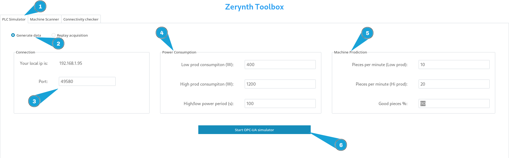

# Zerynth Toolbox for commissioning

[Download for Windows](#){ .md-button } [Download for Linux](#){ .md-button }
      

## Introduction

This toolbox aims to simplify both on site activities and testing of Zerynth apps using the Zerynth agents.
It features a Machine Scanner to acquire data from various PLCs, a PLC Simulator to replay the acquired data or to generate new data via an OPC-UA server and a Connectivity Checker to be able to test whether the Zerynth cloud endpoints are reachable. 
The windows executable is ready to be executed, while on Linux you need to download and then open a terminal and execute the following commands:
```bash
cd ~/Downloads
chmod +x zerynth-toolbox
./zerynth-toolbox
```

## PLC Simulator

The PLC Simulator can be used to simulate a production machine to test the 4ZeroAgent o to replay the data acquired from a real machine.

### Data generation

To simulate a production machine click on the `Generate data` radio button.
The simulated machine operates between two power levels, changing the number of produced pieces and the operation tag accordingly.

Here's how to setup the machine:

* **IP, Port:** The IP and the port where the OPC-UA server is running. While the port is customizable, be sure to double check the IP address as sometimes it can be incorrect (e.g. if the PC has 2 network interfaces, only one IP will be shown).
* **Low prod consumption (W):** the power consumption when the machine operates at the lower power level.
* **High prod consumption (W):** the power consumption when the machine operates at the higher power level.
* **High/low power period (s):** the period spent in each power level (e.g. if set to `10`, the machine will switch level every 10 seconds).
* **Pieces per minute (Low prod):**: how many pieces are produced in the Low production level.
* **Pieces per minute (Hi prod):**: how many pieces are produced in the Hi production level.
* **Good pieces %:** the percentage of good pieces produced.




Once started, the operation can be changed using the textbox (it uses the default operation tags if left empty) and the state of the machine can be controlled with the toggles at the bottom left:

* **Toggle alarm:** this switch sets the machine in the alarm state
* **Toggle idle/working:** this switch sets the machine status. In the idle state the power consumption is automatically set to  1/4 of the `Low prod consumption` value


The OPC-UA server will expose the following nodes:

| Node ID  | Node Name           | Type   |
|:--------:|:-------------------:|:------:|
| ns=1;i=1 | Machine.Consumption | FLOAT  |
| ns=1;i=2 | Machine.Energy      | FLOAT  |
| ns=1;i=3 | Machine.PcsOk       | INT    |
| ns=1;i=4 | Machine.PcsKo       | INT    |
| ns=1;i=5 | Machine.Status      | INT    |
| ns=1;i=6 | Machine.Alarm       | INT    |
| ns=1;i=7 | Machine.Operation   | STRING |

### Replay acquisition

To replay an acquisition recorded using the [Machine Scanner](#recording-a-session), click on the `Replay acquisition` radio button, then click on the `Load acquisition file` and select a valid CSV file.
Now you have to match the OPC-UA nodes with the correct CSV acquisition column. If the acquisition file contains analogic or digital readings, the exported node will be named `ns=1;s=AINX` or `ns=1;s=DINX`.

<!-- insert image -->

Now you can start the server to replay and scrub through the acquisition.

## Machine Scanner

### OPC-UA

To scan an OPC-UA server open the Machine Scanner tab

<!-- image here -->

Insert the following parameters:

* **IP/Hostname, Port and Path:** usually, an OPC-UA server is identified by an url like `opc.tcp://[ip or hostname]:port/path`. Leave the path empty if it's not needed.
* **Username and password:** provide these parameters if the server requires user authentication, otherwise leave them empty.
* **Certificate, key and Application URI:** provide these parameters if they are required by the server. The application URI can be found inspecting the certificate with `openssl x509 -in certificate.crt -text -noout` and usually is something like `urn:host:field1:field2`. 

Now, you can start the scanner and wait for the scanning process to complete.

!!! Note
    The auto refresh feature **is still beta** and can lead to the crash of the application.

Once the scanner has finished its job, a new tab containing the scanned nodes will appear: there it's possible to open the record and the export dialog.

### Recording a session

To record a session click on the `Record` button

<!-- insert image -->

select the nodes to record, connect a 4ZeroBox (check [here](#) how to setup the device) if analogic and digital signal acquisition is required, select the acquisition frequency and start the recording.
To stop the recording, click on the `Record` button again and click on the stop button.
The session is saved on a csv file containing a column with the timestamp in millisecond and the columns containing the values:

| timestamp (ms) | ns=1;i=1 | ns=1;i=3 | ns=1;i=4 | ns=1;i=5 | ns=1;i=6 | ns=1;i=7 |
|:--------------:|:--------:|:--------:|:--------:|:--------:|:--------:|:--------:|
| 1701095566041  | 1168.01  | 50       | 10       | 1        | 0        | HIGH     |
| 1701095566143  | 1201.99  | 50       | 10       | 1        | 0        | HIGH     |
| ...            | ...      | ...      | ...      | ...      | ...      | ...      |
| 1701095594530  | 600.11   | 106      | 16       | 1        | 0        | LOW      |
| 1701095594632  | 700.13   | 106      | 16       | 1        | 0        | LOW      |


### Exporting a table

To export a table click on the `Export table` button, select the nodes to export, then choose the format and click on `Export`.

The CSV format is useful for further reference of the server nodes, here's an example:

| nodeid   | name                | type   |
|:--------:|:-------------------:|:-------:
| ns=1;i=1 | Machine.Consumption | FLOAT  |
| ns=1;i=2 | Machine.Energy      | FLOAT  |
| ns=1;i=3 | Machine.PcsOk       | INT    |
| ns=1;i=4 | Machine.PcsKo       | INT    |
| ns=1;i=5 | Machine.Status      | INT    |
| ns=1;i=6 | Machine.Alarm       | INT    |
| ns=1;i=7 | Machine.Operation   | STRING |


<!-- insert configuator reference  -->

The JSON format, instead, is compatible with the 4ZeroAgent and can be used in the graph configurator (check [here](#)) to configure the `OpcuaNode` graph node.
Here's an example:

```json
{
    "nodes": [
        ["ns=1;i=1","FLOAT"],
        ["ns=1;i=2","FLOAT"],
        ["ns=1;i=3","INT"],
        ["ns=1;i=4","INT"],
        ["ns=1;i=5","INT"],
        ["ns=1;i=6","INT"],
        ["ns=1;i=7","STRING"]
    ]
}
```

## Connectivity Checker

This tool is useful to check whether the cloud endpoints are reachable and up.

<!-- insert image -->


!!! Note
    Make sure to connect the PC to the same network to which the device will be connected.