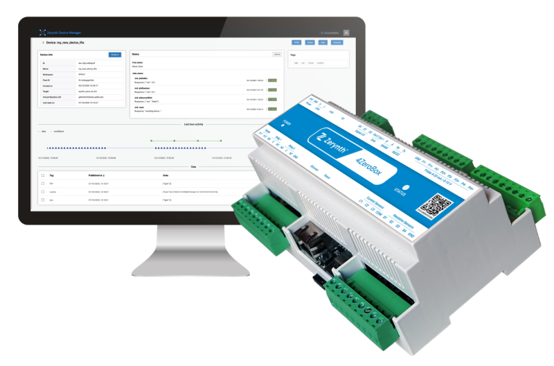

# Technical reference

This section contains the documentation for the vast ecosystem of tools and APIs provided by the SDK.
The technical reference spans a wide range of topics from the details of writing the firmware to the Cloud APIs. 

It can be daunting to navigate all of this information, for an easier approach try search bar on the upper right.

### Hardware

Easy-to-use hardware devices for driving Industrial IoT applications and connected products, for development and mass production.

The ZM1-DB is an efficient and secure development board that features the Zerynth IoT module ZM1.
<figure>
  
</figure>

Thanks to the zBUS you can connect Zerynth expansion boards and quickly add powerful features to your prototype based on your needs.

<figure>
  
</figure>

4ZeroBox and 4ZeroBox mobile are industrial IoT devices for data acquisition, monitoring, and control of industrial machines. 
<figure>
  
</figure>

Each board is supported with a [board support package](libs/expansions/) that automatically configures the hardware and imports the appropriate libraries.

### Firmware

Zerynth OS was designed to enable efficient and short development time. It handles all development layers from hardware configuration till secure cloud communication. 
Zerynth SDK provides different ways for firmware development, It supports [VSCode through the extension ](vscode/index.md) and the [command line interface](cli/ztc/index.md).

### Cloud

Zerynth Cloud is a complete platform that frees you from the burden of maintaining all the technology and infrastructure of developing and deploying fleets of devices, while focusing on the added value of IoT data. From a single interface, provision and manage IoT devices, store and visualize data, and gain valuable insights and issue firmware updates on fleets of devices.
For more information, Check the [device manager documentation](libs/zerynth/zdm/) and [device manager APIs.](api/zdm/)

### FAQ

Your device is not recognized? something is out of place? [Refer to the FAQ section for more details.](faq/hardware/)
